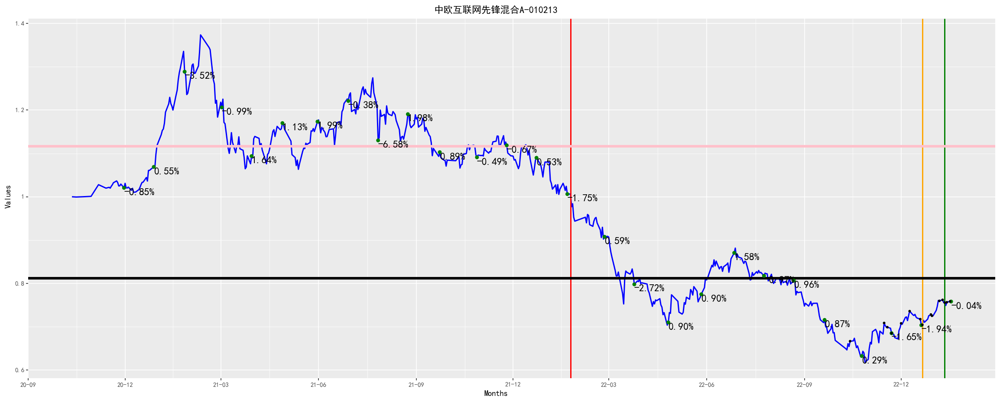
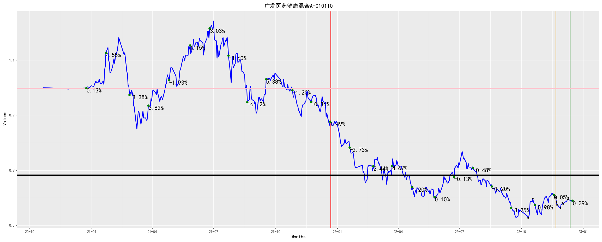
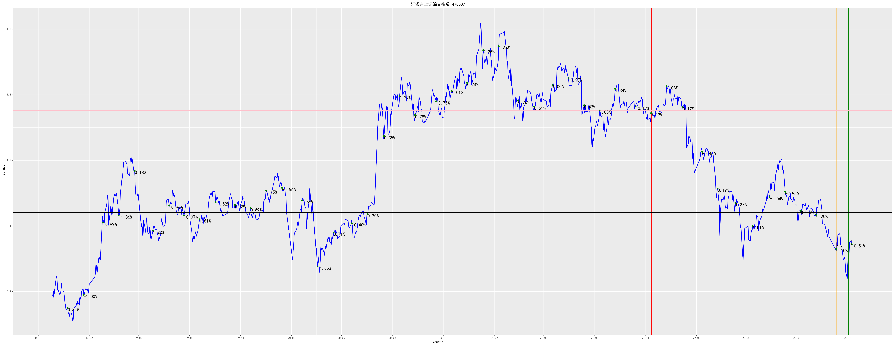
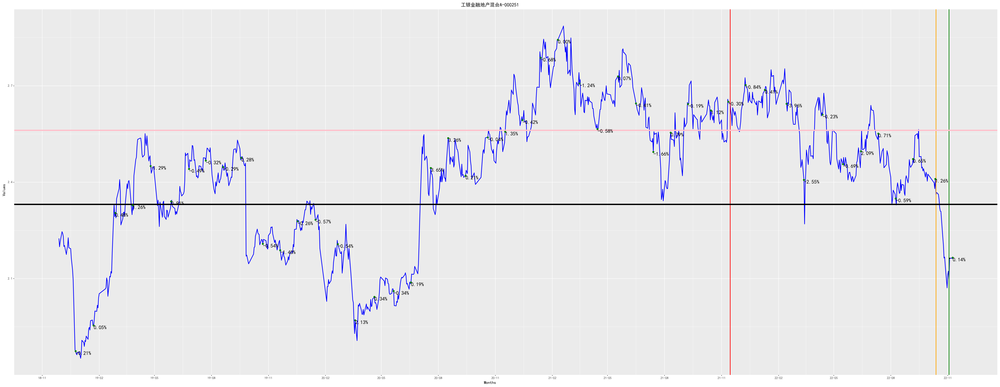

[](https://fund.readthedocs.io/zh_CN/latest/)
[](https://github.com/zhaisilong/fund)

前言
====

-   基于 Python 的量化投资基金的仓库.
-   本仓库所有的信息均不构成投资建议.
-   如果你对次项目感兴趣,欢迎右上角点赞.

安装
====

``` {.bash}
conda create -nfund python=3.8
# 深度学习 pytorch 套装
conda install pytorch torchvision torchaudio cudatoolkit=11.3 -c pytorch
pip install -i https://pypi.tuna.tsinghua.edu.cn/simple -r requirements.txt
```

使用
====

快速入手
--------

``` {.bash}
bash pipeline.sh
```

基本操作
--------

``` {.bash}
python crawl.py  # 爬取基金的信息
python analysis.py  # 基金分析
python track.py  # 基金跟踪
python predict.py  # 基金预测
python strtegy.py  # 制定策略
```

跟踪情况
========

全局跟踪
--------

```{=rst}
投资总金额：340.00元
卖出收益(扣税后)：0.00
基金价值：341.74元
收益率(卖出收益+基金价值/投资总金额,部分扣税)：0.51%

```
中欧互联网先锋混合A-010213
--------------------------

```{=rst}
投资总金额：16.00元
股份数：23.96份
当前每股单价：0.69元/份
卖出收益(扣税后)：0.00
基金价值：16.50元
收益率(卖出收益+基金价值/投资总金额,部分扣税)：3.14%
池子:
        date      stock day_delta  fee/%   value  improve/%
0 2022-10-14  23.962802   26 days    0.5  0.6667   3.299835
按低值出售的池子:
        date      stock day_delta  fee/%   value  improve/%
0 2022-10-14  23.962802   26 days    0.5  0.6667   3.299835

```


广发医药健康混合A-010110
------------------------

```{=rst}
投资总金额：16.00元
股份数：30.34份
当前每股单价：0.60元/份
卖出收益(扣税后)：0.00
基金价值：18.15元
收益率(卖出收益+基金价值/投资总金额,部分扣税)：13.43%
池子:
        date      stock day_delta  fee/%   value  improve/%
0 2022-10-11  30.338017   29 days    0.5  0.5266  13.596658
按低值出售的池子:
        date      stock day_delta  fee/%   value  improve/%
0 2022-10-11  30.338017   29 days    0.5  0.5266  13.596658

```


招商中证白酒指数(LOF)A-161725
-----------------------------

```{=rst}
投资总金额：224.00元
股份数：227.20份
当前每股单价：0.98元/份
卖出收益(扣税后)：0.00
基金价值：222.88元
收益率(卖出收益+基金价值/投资总金额,部分扣税)：-0.50%
池子:
        date       stock day_delta  fee/%   value  improve/%
0 2022-10-12   18.646757   28 days    0.5  1.0715  -8.446104
1 2022-10-13   13.236797   27 days    0.5  1.0566  -7.155026
2 2022-10-18   13.275748   22 days    0.5  1.0535  -6.881822
3 2022-10-19   23.508187   21 days    0.5  1.0199  -3.814099
4 2022-10-20   23.286713   20 days    0.5  1.0296  -4.720280
5 2022-10-24  105.047319   16 days    0.5  0.9510   3.154574
6 2022-10-25   14.748497   15 days    0.5  0.9483   3.448276
7 2022-10-27   15.447316   13 days    0.5  0.9054   8.349901
按低值出售的池子:
        date       stock day_delta  fee/%   value  improve/%
0 2022-10-12   18.646757   28 days    0.5  1.0715  -8.446104
1 2022-10-13   13.236797   27 days    0.5  1.0566  -7.155026
2 2022-10-18   13.275748   22 days    0.5  1.0535  -6.881822
3 2022-10-19   23.508187   21 days    0.5  1.0199  -3.814099
4 2022-10-20   23.286713   20 days    0.5  1.0296  -4.720280
5 2022-10-24  105.047319   16 days    0.5  0.9510   3.154574
6 2022-10-25   14.748497   15 days    0.5  0.9483   3.448276
7 2022-10-27   15.447316   13 days    0.5  0.9054   8.349901

```
A-161725.png)

汇添富上证综合指数-470007
-------------------------

```{=rst}
投资总金额：70.00元
股份数：72.26份
当前每股单价：0.97元/份
卖出收益(扣税后)：0.00
基金价值：70.24元
收益率(卖出收益+基金价值/投资总金额,部分扣税)：0.34%
池子:
        date      stock day_delta  fee/%  value  improve/%
0 2022-10-13  14.418557   27 days    0.5  0.970   0.206186
1 2022-10-20  14.433437   20 days    0.5  0.969   0.309598
2 2022-11-03  14.706625    6 days    1.5  0.951   2.208202
3 2022-11-07  14.315251    2 days    1.5  0.977  -0.511771
4 2022-11-08  14.388889    1 days    1.5  0.972   0.000000
按低值出售的池子:
        date      stock day_delta  fee/%  value  improve/%
0 2022-10-13  14.418557   27 days    0.5  0.970   0.206186
1 2022-10-20  14.433437   20 days    0.5  0.969   0.309598
2 2022-11-03  14.706625    6 days    1.5  0.951   2.208202
3 2022-11-07  14.315251    2 days    1.5  0.977  -0.511771
4 2022-11-08  14.388889    1 days    1.5  0.972   0.000000

```


工银金融地产混合A-000251
------------------------

```{=rst}
投资总金额：14.00元
股份数：6.46份
当前每股单价：2.16元/份
卖出收益(扣税后)：0.00
基金价值：13.97元
收益率(卖出收益+基金价值/投资总金额,部分扣税)：-0.20%
池子:
        date     stock day_delta  fee/%  value  improve/%
0 2022-11-04  6.462783    5 days    1.5  2.163  -0.046232
按低值出售的池子:
        date     stock day_delta  fee/%  value  improve/%
0 2022-11-04  6.462783    5 days    1.5  2.163  -0.046232

```

