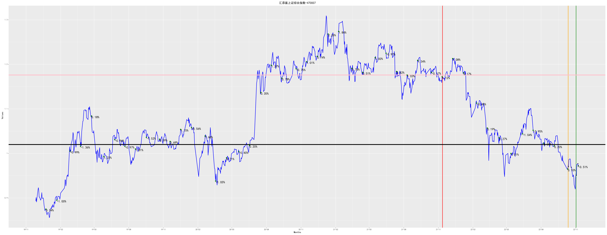
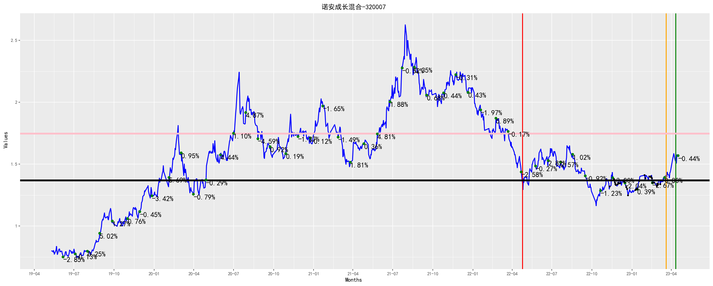

[](https://fund.readthedocs.io/zh_CN/latest/)
[](https://github.com/zhaisilong/fund)

# 前言

-   基于 Python 的量化投资基金的仓库.
-   本仓库所有的信息均不构成投资建议.
-   如果你对次项目感兴趣,欢迎右上角点赞.

# 安装

``` bash
mamba create -nfund python=3.8
mamba activate fund
mamba install pytorch torchvision torchaudio cudatoolkit=11.8 -c pytorch
pip install -e . -i https://pypi.tuna.tsinghua.edu.cn/simple
```

安装 [java runtime]{.title-ref}

``` bash
brew install java
brew install node

# Ubuntu
sudo apt install default-jdk nodejs npm
java -version; node -v; npm -v
```

安装 [pandoc]{.title-ref}

``` bash
brew install pandoc  # for Darwin
sudo apt install pandoc  # for Ubuntu
```

# 使用

## 快速入手

``` bash
bash pipeline.sh  # or notebooks/quick_start.ipynb
```

## 基本操作

``` bash
fund crawl  # 爬取基金的信息
fund analysis  # 基金分析
fund track  # 基金跟踪，记录你的购买和卖出记录；在走势图中打印
# fund predict  # 基金预测 [In Comming]
# fund strtegy  # 制定策略 [In Comming]

# Record your buy and sell information
fund record  # CMD interface
```

## 文档构建

``` bash
make html
make serve
```

## Bug

WARNING matplotlib.font_manager: findfont: Font family \'SimHei\' not
found.

``` bash
fund fix_matplotlib
```

# 跟踪情况

-   三根点
    -   🔴 红色点：卖出
    -   ⚫️ 黑色点：买入
    -   🟢 绿色点：数据点，当日涨跌
-   三根垂直线（除去双休日）
    -   年（红），月（黄），日（绿）
-   两根水平线（3/7 分位线）
    -   黑色（低位线）
    -   粉色（高位线）

## 全局跟踪

``` {literal=""}
投资总金额：467.00元
卖出收益(扣税后)：0.00
基金价值：508.06元
收益率(卖出收益+基金价值/投资总金额,部分扣税)：8.79%
```

## 中欧互联网先锋混合A-010213

``` {literal=""}
```


## 广发医药健康混合A-010110

``` {literal=""}
```


## 招商中证白酒指数(LOF)A-161725

``` {literal=""}
```

A-161725.png)

## 汇添富上证综合指数-470007

``` {literal=""}
```



## 工银金融地产混合A-000251

``` {literal=""}
```


## 交银创业板50指数A-007464

``` {literal=""}
```


## 诺安成长混合-320007

``` {literal=""}
```



## 富国中证新能源汽车指数(LOF)A-161028

``` {literal=""}
投资总金额：467.00元
股份数：429.83份
当前每股单价：1.18元/份
卖出收益(扣税后)：0.00
基金价值：508.06元
收益率(卖出收益+基金价值/投资总金额,部分扣税)：8.79%
池子:
         date      stock day_delta  fee/%  value  improve/%
0  2023-01-05  11.036464 1144 days    0.0  1.086   8.839779
1  2023-01-06  10.856522 1143 days    0.0  1.104   7.065217
2  2023-01-09  10.788119 1140 days    0.0  1.111   6.390639
3  2023-01-11  10.817329 1138 days    0.0  1.108   6.678700
4  2023-01-13  10.578641 1136 days    0.0  1.133   4.324801
5  2023-01-16  10.587986 1133 days    0.0  1.132   4.416961
6  2023-01-18  10.532162 1131 days    0.0  1.138   3.866432
7  2023-01-30  10.088889 1119 days    0.0  1.188  -0.505051
8  2023-02-01   9.905455 1117 days    0.0  1.210  -2.314050
9  2023-02-08  10.252866 1110 days    0.0  1.169   1.112062
10 2023-02-10  17.235548 1108 days    0.0  1.159   1.984469
11 2023-02-13  10.296907 1105 days    0.0  1.164   1.546392
12 2023-02-14  10.332414 1104 days    0.0  1.160   1.896552
13 2023-02-15  10.413206 1103 days    0.0  1.151   2.693310
14 2023-02-16  10.587986 1102 days    0.0  1.132   4.416961
15 2023-02-17  10.807574 1101 days    0.0  1.109   6.582507
16 2023-02-21  10.768733 1097 days    0.0  1.113   6.199461
17 2023-02-22  10.886104 1096 days    0.0  1.101   7.356948
18 2023-02-27  11.046636 1091 days    0.0  1.085   8.940092
19 2023-02-28  10.995963 1090 days    0.0  1.090   8.440367
20 2023-03-06  11.087512 1084 days    0.0  1.081   9.343201
21 2023-03-07  11.264662 1083 days    0.0  1.064  11.090226
22 2023-03-22  99.783123 1068 days    0.0  1.031  14.645975
23 2023-04-04  11.762120 1055 days    0.0  1.019  15.996075
24 2023-04-17  26.736520 1042 days    0.0  1.046  13.001912
25 2023-04-18  26.736520 1041 days    0.0  1.046  13.001912
26 2023-04-19  11.513545 1040 days    0.0  1.041  13.544669
27 2023-04-24  12.131174 1035 days    0.0  0.988  19.635628
按低值出售的池子:
         date      stock day_delta  fee/%  value  improve/%
0  2023-01-05  11.036464 1144 days    0.0  1.086   8.839779
1  2023-01-06  10.856522 1143 days    0.0  1.104   7.065217
2  2023-01-09  10.788119 1140 days    0.0  1.111   6.390639
3  2023-01-11  10.817329 1138 days    0.0  1.108   6.678700
4  2023-01-13  10.578641 1136 days    0.0  1.133   4.324801
5  2023-01-16  10.587986 1133 days    0.0  1.132   4.416961
6  2023-01-18  10.532162 1131 days    0.0  1.138   3.866432
7  2023-01-30  10.088889 1119 days    0.0  1.188  -0.505051
8  2023-02-01   9.905455 1117 days    0.0  1.210  -2.314050
9  2023-02-08  10.252866 1110 days    0.0  1.169   1.112062
10 2023-02-10  17.235548 1108 days    0.0  1.159   1.984469
11 2023-02-13  10.296907 1105 days    0.0  1.164   1.546392
12 2023-02-14  10.332414 1104 days    0.0  1.160   1.896552
13 2023-02-15  10.413206 1103 days    0.0  1.151   2.693310
14 2023-02-16  10.587986 1102 days    0.0  1.132   4.416961
15 2023-02-17  10.807574 1101 days    0.0  1.109   6.582507
16 2023-02-21  10.768733 1097 days    0.0  1.113   6.199461
17 2023-02-22  10.886104 1096 days    0.0  1.101   7.356948
18 2023-02-27  11.046636 1091 days    0.0  1.085   8.940092
19 2023-02-28  10.995963 1090 days    0.0  1.090   8.440367
20 2023-03-06  11.087512 1084 days    0.0  1.081   9.343201
21 2023-03-07  11.264662 1083 days    0.0  1.064  11.090226
22 2023-03-22  99.783123 1068 days    0.0  1.031  14.645975
23 2023-04-04  11.762120 1055 days    0.0  1.019  15.996075
24 2023-04-17  26.736520 1042 days    0.0  1.046  13.001912
25 2023-04-18  26.736520 1041 days    0.0  1.046  13.001912
26 2023-04-19  11.513545 1040 days    0.0  1.041  13.544669
27 2023-04-24  12.131174 1035 days    0.0  0.988  19.635628
```

A-161028.png)
