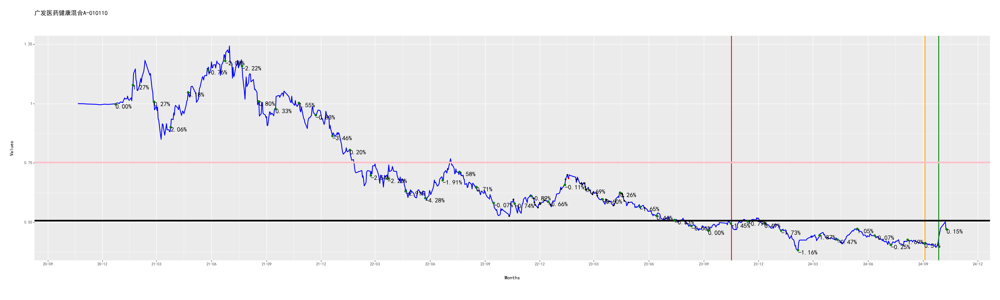

[](https://fund.readthedocs.io/zh_CN/latest/)
[](https://github.com/zhaisilong/fund)

# 前言

-   基于 Python 的量化投资基金的仓库.
-   本仓库所有的信息均不构成投资建议.
-   如果你对次项目感兴趣,欢迎右上角点赞.

# 安装

``` bash
conda create -nfund python=3.8
# 深度学习 pytorch 套装
conda install pytorch torchvision torchaudio cudatoolkit=11.3 -c pytorch
pip install -i https://pypi.tuna.tsinghua.edu.cn/simple -r requirements.txt
```

安装 [java runtime]{.title-ref}

``` bash
brew install java
brew install node
```

安装 [pandoc]{.title-ref}

``` bash
brew install pandoc  # for Darwin
sudo apt install pandoc  # for Ubuntu
```

# 使用

## 快速入手

``` bash
bash pipeline.sh
```

## 基本操作

``` bash
python crawl.py  # 爬取基金的信息
python analysis.py  # 基金分析
python track.py  # 基金跟踪
python predict.py  # 基金预测
python strtegy.py  # 制定策略
```

# 跟踪情况

## 全局跟踪

``` {. literal=""}
投资总金额：694.00元
卖出收益(扣税后)：10.02
基金价值：697.25元
收益率(卖出收益+基金价值/投资总金额,部分扣税)：1.91%
```

## 中欧互联网先锋混合A-010213

``` {. literal=""}
投资总金额：64.00元
股份数：92.68份
当前每股单价：0.70元/份
卖出收益(扣税后)：0.00
基金价值：64.65元
收益率(卖出收益+基金价值/投资总金额,部分扣税)：1.02%
池子:
        date      stock day_delta  fee/%   value  improve/%
0 2022-10-14  23.962802   48 days    0.5  0.6667   4.634768
1 2022-11-15  22.542684   16 days    0.5  0.7087  -1.566248
2 2022-11-18  22.855508   13 days    0.5  0.6990  -0.200286
3 2022-11-22  23.319223    9 days    0.5  0.6851   1.824551
按低值出售的池子:
        date      stock day_delta  fee/%   value  improve/%
0 2022-10-14  23.962802   48 days    0.5  0.6667   4.634768
1 2022-11-15  22.542684   16 days    0.5  0.7087  -1.566248
2 2022-11-18  22.855508   13 days    0.5  0.6990  -0.200286
3 2022-11-22  23.319223    9 days    0.5  0.6851   1.824551
```


## 广发医药健康混合A-010110

``` {. literal=""}
投资总金额：96.00元
股份数：167.30份
当前每股单价：0.57元/份
卖出收益(扣税后)：0.00
基金价值：96.00元
收益率(卖出收益+基金价值/投资总金额,部分扣税)：-0.00%
池子:
        date      stock day_delta  fee/%   value  improve/%
0 2022-10-11  30.338017   51 days    0.5  0.5266   8.963160
1 2022-10-18  26.773923   44 days    0.5  0.5967  -3.837774
2 2022-11-21  26.608927   10 days    0.5  0.6004  -4.430380
3 2022-11-22  27.318741    9 days    0.5  0.5848  -1.880985
4 2022-11-23  27.842454    8 days    0.5  0.5738   0.000000
5 2022-11-28  28.416933    3 days    1.5  0.5622   2.063323
按低值出售的池子:
        date      stock day_delta  fee/%   value  improve/%
0 2022-10-11  30.338017   51 days    0.5  0.5266   8.963160
1 2022-10-18  26.773923   44 days    0.5  0.5967  -3.837774
2 2022-11-21  26.608927   10 days    0.5  0.6004  -4.430380
3 2022-11-22  27.318741    9 days    0.5  0.5848  -1.880985
4 2022-11-23  27.842454    8 days    0.5  0.5738   0.000000
5 2022-11-28  28.416933    3 days    1.5  0.5622   2.063323
```



## 招商中证白酒指数(LOF)A-161725

``` {. literal=""}
投资总金额：280.00元
股份数：278.95份
当前每股单价：1.02元/份
卖出收益(扣税后)：5.11
基金价值：283.58元
收益率(卖出收益+基金价值/投资总金额,部分扣税)：3.10%
池子:
         date       stock day_delta  fee/%   value  improve/%
0  2022-10-12   13.646757   50 days    0.5  1.0715  -5.123658
1  2022-10-13   13.236797   49 days    0.5  1.0566  -3.785728
2  2022-10-18   13.275748   44 days    0.5  1.0535  -3.502610
3  2022-10-19   23.508187   43 days    0.5  1.0199  -0.323561
4  2022-10-20   23.286713   42 days    0.5  1.0296  -1.262626
5  2022-10-24  105.047319   38 days    0.5  0.9510   6.898002
6  2022-10-25   14.748497   37 days    0.5  0.9483   7.202362
7  2022-10-27   15.447316   35 days    0.5  0.9054  12.281864
8  2022-11-09   14.475264   22 days    0.5  0.9662   5.216311
9  2022-11-14   13.946949   17 days    0.5  1.0028   1.376147
10 2022-11-21   14.070423   10 days    0.5  0.9940   2.273642
11 2022-11-24   14.264151    7 days    0.5  0.9805   3.681795
按低值出售的池子:
         date       stock day_delta  fee/%   value  improve/%
0  2022-10-12   18.646757   50 days    0.5  1.0715  -5.123658
1  2022-10-13   13.236797   49 days    0.5  1.0566  -3.785728
2  2022-10-18   13.275748   44 days    0.5  1.0535  -3.502610
3  2022-10-19   23.508187   43 days    0.5  1.0199  -0.323561
4  2022-10-20   23.286713   42 days    0.5  1.0296  -1.262626
5  2022-10-24  105.047319   38 days    0.5  0.9510   6.898002
6  2022-10-25   14.748497   37 days    0.5  0.9483   7.202362
7  2022-10-27   10.447316   35 days    0.5  0.9054  12.281864
8  2022-11-09   14.475264   22 days    0.5  0.9662   5.216311
9  2022-11-14   13.946949   17 days    0.5  1.0028   1.376147
10 2022-11-21   14.070423   10 days    0.5  0.9940   2.273642
11 2022-11-24   14.264151    7 days    0.5  0.9805   3.681795
```

A-161725.png)

## 汇添富上证综合指数-470007

``` {. literal=""}
投资总金额：84.00元
股份数：86.43份
当前每股单价：1.01元/份
卖出收益(扣税后)：0.00
基金价值：87.30元
收益率(卖出收益+基金价值/投资总金额,部分扣税)：3.93%
池子:
        date      stock day_delta  fee/%  value  improve/%
0 2022-10-13  14.418557   49 days    0.5  0.970   4.123711
1 2022-10-20  14.433437   42 days    0.5  0.969   4.231166
2 2022-11-03  14.706625   28 days    0.5  0.951   6.203996
3 2022-11-07  14.315251   24 days    0.5  0.977   3.377687
4 2022-11-08  14.388889   23 days    0.5  0.972   3.909465
5 2022-11-18  14.170213   13 days    0.5  0.987   2.330294
按低值出售的池子:
        date      stock day_delta  fee/%  value  improve/%
0 2022-10-13  14.418557   49 days    0.5  0.970   4.123711
1 2022-10-20  14.433437   42 days    0.5  0.969   4.231166
2 2022-11-03  14.706625   28 days    0.5  0.951   6.203996
3 2022-11-07  14.315251   24 days    0.5  0.977   3.377687
4 2022-11-08  14.388889   23 days    0.5  0.972   3.909465
5 2022-11-18  14.170213   13 days    0.5  0.987   2.330294
```


## 工银金融地产混合A-000251

``` {. literal=""}
投资总金额：14.00元
股份数：4.31份
当前每股单价：2.47元/份
卖出收益(扣税后)：4.91
基金价值：10.64元
收益率(卖出收益+基金价值/投资总金额,部分扣税)：11.08%
池子:
        date     stock day_delta  fee/%  value  improve/%
0 2022-11-04  4.312783   27 days    0.5  2.163  14.054554
按低值出售的池子:
        date     stock day_delta  fee/%  value  improve/%
0 2022-11-04  4.312783   27 days    0.5  2.163  14.054554
```


## 交银创业板50指数A-007464

``` {. literal=""}
投资总金额：60.00元
股份数：37.75份
当前每股单价：1.59元/份
卖出收益(扣税后)：0.00
基金价值：60.02元
收益率(卖出收益+基金价值/投资总金额,部分扣税)：0.03%
池子:
        date     stock day_delta  fee/%   value  improve/%
0 2022-11-10  7.525437   21 days    0.5  1.5922  -0.150735
1 2022-11-14  7.452419   17 days    0.5  1.6078  -1.119542
2 2022-11-17  7.438540   14 days    0.5  1.6108  -1.303700
3 2022-11-25  7.646946    6 days    1.5  1.5669   1.461484
4 2022-11-28  7.687668    3 days    1.5  1.5586   2.001796
按低值出售的池子:
        date     stock day_delta  fee/%   value  improve/%
0 2022-11-10  7.525437   21 days    0.5  1.5922  -0.150735
1 2022-11-14  7.452419   17 days    0.5  1.6078  -1.119542
2 2022-11-17  7.438540   14 days    0.5  1.6108  -1.303700
3 2022-11-25  7.646946    6 days    1.5  1.5669   1.461484
4 2022-11-28  7.687668    3 days    1.5  1.5586   2.001796
```


