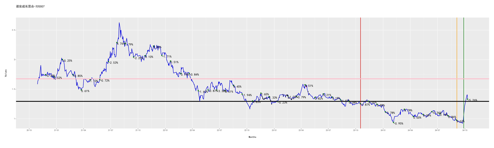

[](https://fund.readthedocs.io/zh_CN/latest/)
[](https://github.com/zhaisilong/fund)

前言
====

-   基于 Python 的量化投资基金的仓库.
-   本仓库所有的信息均不构成投资建议.
-   如果你对次项目感兴趣,欢迎右上角点赞.

安装
====

``` {.bash}
mamba create -nfund python=3.8
mamba activate fund
mamba install pytorch torchvision torchaudio cudatoolkit=11.8 -c pytorch
pip install -i https://pypi.tuna.tsinghua.edu.cn/simple -r requirements.txt
```

安装 [java runtime]{.title-ref}

``` {.bash}
brew install java
brew install node

# Ubuntu
sudo apt install default-jdk nodejs npm
java -version; node -v; npm -v
```

安装 [pandoc]{.title-ref}

``` {.bash}
brew install pandoc  # for Darwin
sudo apt install pandoc  # for Ubuntu
```

使用
====

快速入手
--------

``` {.bash}
bash pipeline.sh
```

基本操作
--------

``` {.bash}
python crawl.py  # 爬取基金的信息
python analysis.py  # 基金分析
python track.py  # 基金跟踪
python predict.py  # 基金预测
python strtegy.py  # 制定策略
```

Bug
---

WARNING matplotlib.font\_manager: findfont: Font family \'SimHei\' not
found.

``` {.bash
sudo apt install msttcorefonts
rm ~/.cache/matplotlib -rf}
```

跟踪情况
========

全局跟踪
--------

```{=rst}
投资总金额：3684.00元
卖出收益(扣税后)：445.77
基金价值：2900.73元
收益率(卖出收益+基金价值/投资总金额,部分扣税)：-9.16%

```
中欧互联网先锋混合A-010213
--------------------------

```{=rst}
投资总金额：480.00元
股份数：652.47份
当前每股单价：0.72元/份
卖出收益(扣税后)：0.00
基金价值：471.48元
收益率(卖出收益+基金价值/投资总金额,部分扣税)：-1.78%
池子:
         date      stock day_delta  fee/%   value  improve/%
0  2022-10-14  23.962802  728 days   0.25  0.6667   8.384581
1  2022-11-15  22.542684  696 days   0.25  0.7087   1.961338
2  2022-11-18  22.855508  693 days   0.25  0.6990   3.376252
3  2022-11-22  23.319223  689 days   0.25  0.6851   5.473653
4  2022-12-01  22.568159  680 days   0.25  0.7079   2.076564
5  2022-12-09  21.706522  672 days   0.25  0.7360  -1.820652
6  2022-12-19  22.266202  662 days   0.25  0.7175   0.710801
7  2022-12-21  22.677076  660 days   0.25  0.7045   2.569198
8  2022-12-29  21.936015  652 days   0.25  0.7283  -0.782645
9  2022-12-30  22.026748  651 days   0.25  0.7253  -0.372260
10 2023-01-06  21.029354  644 days   0.25  0.7597  -4.883507
11 2023-01-09  20.963128  641 days   0.25  0.7621  -5.183047
12 2023-01-11  21.140664  639 days   0.25  0.7557  -4.380045
13 2023-01-13  21.115517  637 days   0.25  0.7566  -4.493788
14 2023-01-16  21.062624  634 days   0.25  0.7585  -4.733026
15 2023-01-18  20.965879  632 days   0.25  0.7620  -5.170604
16 2023-01-20  20.643494  630 days   0.25  0.7739  -6.628763
17 2023-01-30  20.691620  620 days   0.25  0.7721  -6.411087
18 2023-02-01  20.627502  618 days   0.25  0.7745  -6.701097
19 2023-02-08  21.270137  611 days   0.25  0.7511  -3.794435
20 2023-02-10  21.332621  609 days   0.25  0.7489  -3.511817
21 2023-02-14  21.157463  605 days   0.25  0.7551  -4.304066
22 2023-02-15  21.349726  604 days   0.25  0.7483  -3.434451
23 2023-02-17  21.860974  602 days   0.25  0.7308  -1.122058
24 2023-02-21  21.574612  598 days   0.25  0.7405  -2.417286
25 2023-02-22  21.736054  597 days   0.25  0.7350  -1.687075
26 2023-02-22  21.736054  597 days   0.25  0.7350  -1.687075
27 2023-02-27  22.090708  592 days   0.25  0.7232  -0.082965
28 2023-02-28  22.127424  591 days   0.25  0.7220   0.083102
29 2023-03-07  22.136622  584 days   0.25  0.7217   0.124706
按低值出售的池子:
         date      stock day_delta  fee/%   value  improve/%
0  2022-10-14  23.962802  728 days   0.25  0.6667   8.384581
1  2022-11-15  22.542684  696 days   0.25  0.7087   1.961338
2  2022-11-18  22.855508  693 days   0.25  0.6990   3.376252
3  2022-11-22  23.319223  689 days   0.25  0.6851   5.473653
4  2022-12-01  22.568159  680 days   0.25  0.7079   2.076564
5  2022-12-09  21.706522  672 days   0.25  0.7360  -1.820652
6  2022-12-19  22.266202  662 days   0.25  0.7175   0.710801
7  2022-12-21  22.677076  660 days   0.25  0.7045   2.569198
8  2022-12-29  21.936015  652 days   0.25  0.7283  -0.782645
9  2022-12-30  22.026748  651 days   0.25  0.7253  -0.372260
10 2023-01-06  21.029354  644 days   0.25  0.7597  -4.883507
11 2023-01-09  20.963128  641 days   0.25  0.7621  -5.183047
12 2023-01-11  21.140664  639 days   0.25  0.7557  -4.380045
13 2023-01-13  21.115517  637 days   0.25  0.7566  -4.493788
14 2023-01-16  21.062624  634 days   0.25  0.7585  -4.733026
15 2023-01-18  20.965879  632 days   0.25  0.7620  -5.170604
16 2023-01-20  20.643494  630 days   0.25  0.7739  -6.628763
17 2023-01-30  20.691620  620 days   0.25  0.7721  -6.411087
18 2023-02-01  20.627502  618 days   0.25  0.7745  -6.701097
19 2023-02-08  21.270137  611 days   0.25  0.7511  -3.794435
20 2023-02-10  21.332621  609 days   0.25  0.7489  -3.511817
21 2023-02-14  21.157463  605 days   0.25  0.7551  -4.304066
22 2023-02-15  21.349726  604 days   0.25  0.7483  -3.434451
23 2023-02-17  21.860974  602 days   0.25  0.7308  -1.122058
24 2023-02-21  21.574612  598 days   0.25  0.7405  -2.417286
25 2023-02-22  21.736054  597 days   0.25  0.7350  -1.687075
26 2023-02-22  21.736054  597 days   0.25  0.7350  -1.687075
27 2023-02-27  22.090708  592 days   0.25  0.7232  -0.082965
28 2023-02-28  22.127424  591 days   0.25  0.7220   0.083102
29 2023-03-07  22.136622  584 days   0.25  0.7217   0.124706

```


广发医药健康混合A-010110
------------------------

```{=rst}
投资总金额：842.00元
股份数：1311.56份
当前每股单价：0.47元/份
卖出收益(扣税后)：55.81
基金价值：617.75元
收益率(卖出收益+基金价值/投资总金额,部分扣税)：-20.00%
池子:
         date       stock day_delta  fee/%   value  improve/%
0  2022-11-21    1.880868  690 days   0.25  0.6004 -21.552298
1  2022-11-22   27.318741  689 days   0.25  0.5848 -19.459644
2  2022-11-23   27.842454  688 days   0.25  0.5738 -17.915650
3  2022-11-28   28.416933  683 days   0.25  0.5622 -16.221985
4  2022-12-01   27.431319  680 days   0.25  0.5824 -19.127747
5  2022-12-02   27.668860  679 days   0.25  0.5774 -18.427433
6  2022-12-09   94.277525  672 days   0.25  0.5931 -20.586748
7  2022-12-19   27.866736  662 days   0.25  0.5733 -17.844061
8  2023-01-06   24.943013  644 days   0.25  0.6405 -26.463700
9  2023-01-13   23.452730  637 days   0.25  0.6812 -30.857311
10 2023-01-16   22.822857  634 days   0.25  0.7000 -32.714286
11 2023-02-01   23.463064  618 days   0.25  0.6809 -30.826847
12 2023-02-08   24.078372  611 days   0.25  0.6635 -29.012811
13 2023-02-10   24.191399  609 days   0.25  0.6604 -28.679588
14 2023-02-13   23.987988  606 days   0.25  0.6660 -29.279279
15 2023-02-14   24.063865  605 days   0.25  0.6639 -29.055581
16 2023-02-15   44.582756  604 days   0.25  0.6495 -27.482679
17 2023-02-16   45.350822  603 days   0.25  0.6385 -26.233359
18 2023-02-17   25.099764  602 days   0.25  0.6365 -26.001571
19 2023-02-21   25.072191  598 days   0.25  0.6372 -26.082863
20 2023-02-27   25.842769  592 days   0.25  0.6182 -23.811064
21 2023-02-28   25.533003  591 days   0.25  0.6257 -24.724309
22 2023-03-06   25.647777  585 days   0.25  0.6229 -24.385937
23 2023-03-07   26.074751  584 days   0.25  0.6127 -23.127142
24 2023-03-07   26.074751  584 days   0.25  0.6127 -23.127142
25 2023-03-22   26.805369  569 days   0.25  0.5960 -20.973154
26 2023-03-27   61.049592  564 days   0.25  0.5888 -20.006793
27 2023-04-03  237.821366  557 days   0.25  0.5710 -17.513135
28 2023-04-04   97.465574  556 days   0.25  0.5737 -17.901342
29 2023-04-17   36.916091  543 days   0.25  0.6221 -24.288700
30 2023-04-18   25.922440  542 days   0.25  0.6163 -23.576180
31 2023-04-19   26.237477  541 days   0.25  0.6089 -22.647397
32 2023-04-21   48.995770  539 days   0.25  0.5910 -20.304569
33 2023-04-28   27.365536  532 days   0.25  0.5838 -19.321686
按低值出售的池子:
         date       stock day_delta  fee/%   value  improve/%
0  2022-10-18   26.773923  724 days   0.25  0.5967 -21.065862
1  2022-11-21   26.608927  690 days   0.25  0.6004 -21.552298
2  2022-11-22   27.318741  689 days   0.25  0.5848 -19.459644
3  2022-11-23   27.842454  688 days   0.25  0.5738 -17.915650
4  2022-12-01   27.431319  680 days   0.25  0.5824 -19.127747
5  2022-12-02   27.668860  679 days   0.25  0.5774 -18.427433
6  2022-12-09   94.277525  672 days   0.25  0.5931 -20.586748
7  2022-12-19    4.781687  662 days   0.25  0.5733 -17.844061
8  2023-01-06   24.943013  644 days   0.25  0.6405 -26.463700
9  2023-01-13   23.452730  637 days   0.25  0.6812 -30.857311
10 2023-01-16   22.822857  634 days   0.25  0.7000 -32.714286
11 2023-02-01   23.463064  618 days   0.25  0.6809 -30.826847
12 2023-02-08   24.078372  611 days   0.25  0.6635 -29.012811
13 2023-02-10   24.191399  609 days   0.25  0.6604 -28.679588
14 2023-02-13   23.987988  606 days   0.25  0.6660 -29.279279
15 2023-02-14   24.063865  605 days   0.25  0.6639 -29.055581
16 2023-02-15   44.582756  604 days   0.25  0.6495 -27.482679
17 2023-02-16   45.350822  603 days   0.25  0.6385 -26.233359
18 2023-02-17   25.099764  602 days   0.25  0.6365 -26.001571
19 2023-02-21   25.072191  598 days   0.25  0.6372 -26.082863
20 2023-02-27   25.842769  592 days   0.25  0.6182 -23.811064
21 2023-02-28   25.533003  591 days   0.25  0.6257 -24.724309
22 2023-03-06   25.647777  585 days   0.25  0.6229 -24.385937
23 2023-03-07   26.074751  584 days   0.25  0.6127 -23.127142
24 2023-03-07   26.074751  584 days   0.25  0.6127 -23.127142
25 2023-03-22   26.805369  569 days   0.25  0.5960 -20.973154
26 2023-03-27   61.049592  564 days   0.25  0.5888 -20.006793
27 2023-04-03  237.821366  557 days   0.25  0.5710 -17.513135
28 2023-04-04   97.465574  556 days   0.25  0.5737 -17.901342
29 2023-04-17   36.916091  543 days   0.25  0.6221 -24.288700
30 2023-04-18   25.922440  542 days   0.25  0.6163 -23.576180
31 2023-04-19   26.237477  541 days   0.25  0.6089 -22.647397
32 2023-04-21   48.995770  539 days   0.25  0.5910 -20.304569
33 2023-04-28   27.365536  532 days   0.25  0.5838 -19.321686

```


招商中证白酒指数(LOF)A-161725
-----------------------------

```{=rst}
投资总金额：440.00元
股份数：239.34份
当前每股单价：0.88元/份
卖出收益(扣税后)：200.93
基金价值：211.60元
收益率(卖出收益+基金价值/投资总金额,部分扣税)：-6.24%
池子:
         date      stock day_delta  fee/%   value  improve/%
0  2022-10-24  19.361521  718 days   0.25  0.9510  -7.034700
1  2022-10-25  14.748497  717 days   0.25  0.9483  -6.770009
2  2022-10-27  15.447316  715 days   0.25  0.9054  -2.352551
3  2022-11-09  14.475264  702 days   0.25  0.9662  -8.497206
4  2022-11-14  13.946949  697 days   0.25  1.0028 -11.836857
5  2022-11-21  14.070423  690 days   0.25  0.9940 -11.056338
6  2022-11-24  14.264151  687 days   0.25  0.9805  -9.831719
7  2022-12-26  12.238362  655 days   0.25  1.1428 -22.637382
8  2022-12-29  12.222319  652 days   0.25  1.1443 -22.738792
9  2023-01-09  11.398533  641 days   0.25  1.2270 -27.946210
10 2023-02-08  11.655971  611 days   0.25  1.1999 -26.318860
11 2023-02-14  10.947088  605 days   0.25  1.2776 -30.799937
12 2023-02-21  10.928270  598 days   0.25  1.2798 -30.918894
13 2023-02-22  10.969412  597 days   0.25  1.2750 -30.658824
14 2023-03-06  11.170034  585 days   0.25  1.2521 -29.390624
15 2023-03-07  11.366111  584 days   0.25  1.2305 -28.151158
16 2023-04-14  30.125055  546 days   0.25  1.1275 -21.587583
按低值出售的池子:
         date      stock day_delta  fee/%   value  improve/%
0  2022-10-12  18.646757  730 days   0.00  1.0715 -17.489501
1  2022-10-13  13.236797  729 days   0.25  1.0566 -16.325951
2  2022-10-18  13.275748  724 days   0.25  1.0535 -16.079734
3  2022-10-19  23.508187  723 days   0.25  1.0199 -13.315031
4  2022-10-20  23.286713  722 days   0.25  1.0296 -14.131702
5  2022-11-14  13.946949  697 days   0.25  1.0028 -11.836857
6  2022-11-21   0.412969  690 days   0.25  0.9940 -11.056338
7  2022-12-26  12.238362  655 days   0.25  1.1428 -22.637382
8  2022-12-29  12.222319  652 days   0.25  1.1443 -22.738792
9  2023-01-09  11.398533  641 days   0.25  1.2270 -27.946210
10 2023-02-08  11.655971  611 days   0.25  1.1999 -26.318860
11 2023-02-14  10.947088  605 days   0.25  1.2776 -30.799937
12 2023-02-21  10.928270  598 days   0.25  1.2798 -30.918894
13 2023-02-22  10.969412  597 days   0.25  1.2750 -30.658824
14 2023-03-06  11.170034  585 days   0.25  1.2521 -29.390624
15 2023-03-07  11.366111  584 days   0.25  1.2305 -28.151158
16 2023-04-14  30.125055  546 days   0.25  1.1275 -21.587583

```
A-161725.png)

汇添富上证综合指数-470007
-------------------------

```{=rst}
投资总金额：154.00元
股份数：155.39份
当前每股单价：1.08元/份
卖出收益(扣税后)：0.00
基金价值：168.60元
收益率(卖出收益+基金价值/投资总金额,部分扣税)：9.48%
池子:
         date      stock day_delta  fee/%  value  improve/%
0  2022-10-13  14.418557  729 days   0.25  0.970  11.855670
1  2022-10-20  14.433437  722 days   0.25  0.969  11.971104
2  2022-11-03  14.706625  708 days   0.25  0.951  14.090431
3  2022-11-07  14.315251  704 days   0.25  0.977  11.054248
4  2022-11-08  14.388889  703 days   0.25  0.972  11.625514
5  2022-11-18  14.170213  693 days   0.25  0.987   9.929078
6  2022-12-19  13.916418  662 days   0.25  1.005   7.960199
7  2022-12-21  14.084592  660 days   0.25  0.993   9.264854
8  2022-12-23  14.127273  658 days   0.25  0.990   9.595960
9  2023-02-10  13.409396  609 days   0.25  1.043   4.026846
10 2023-02-16  13.422265  603 days   0.25  1.042   4.126679
按低值出售的池子:
         date      stock day_delta  fee/%  value  improve/%
0  2022-10-13  14.418557  729 days   0.25  0.970  11.855670
1  2022-10-20  14.433437  722 days   0.25  0.969  11.971104
2  2022-11-03  14.706625  708 days   0.25  0.951  14.090431
3  2022-11-07  14.315251  704 days   0.25  0.977  11.054248
4  2022-11-08  14.388889  703 days   0.25  0.972  11.625514
5  2022-11-18  14.170213  693 days   0.25  0.987   9.929078
6  2022-12-19  13.916418  662 days   0.25  1.005   7.960199
7  2022-12-21  14.084592  660 days   0.25  0.993   9.264854
8  2022-12-23  14.127273  658 days   0.25  0.990   9.595960
9  2023-02-10  13.409396  609 days   0.25  1.043   4.026846
10 2023-02-16  13.422265  603 days   0.25  1.042   4.126679

```


工银金融地产混合A-000251
------------------------

```{=rst}
投资总金额：28.00元
股份数：10.06份
当前每股单价：2.64元/份
卖出收益(扣税后)：4.91
基金价值：26.57元
收益率(卖出收益+基金价值/投资总金额,部分扣税)：12.44%
池子:
        date     stock day_delta  fee/%  value  improve/%
0 2022-11-04  4.312783  707 days   0.25  2.163  22.098937
1 2023-02-08  5.747944  611 days   0.25  2.432   8.593750
按低值出售的池子:
        date     stock day_delta  fee/%  value  improve/%
0 2022-11-04  4.312783  707 days   0.25  2.163  22.098937
1 2023-02-08  5.747944  611 days   0.25  2.432   8.593750

```


交银创业板50指数A-007464
------------------------

```{=rst}
投资总金额：690.00元
股份数：437.46份
当前每股单价：1.50元/份
卖出收益(扣税后)：0.00
基金价值：654.30元
收益率(卖出收益+基金价值/投资总金额,部分扣税)：-5.17%
池子:
         date      stock day_delta  fee/%   value  improve/%
0  2022-11-10   7.525437  701 days   0.25  1.5922  -6.060796
1  2022-11-14   7.452419  697 days   0.25  1.6078  -6.972260
2  2022-11-17   7.438540  694 days   0.25  1.6108  -7.145518
3  2022-11-25   7.646946  686 days   0.25  1.5669  -4.544004
4  2022-11-28   7.687668  683 days   0.25  1.5586  -4.035673
5  2022-12-01   7.426092  680 days   0.25  1.6135  -7.300899
6  2022-12-05   7.451956  676 days   0.25  1.6079  -6.978046
7  2022-12-09   7.279023  672 days   0.25  1.6461  -9.136747
8  2022-12-14   7.472870  667 days   0.25  1.6034  -6.716976
9  2022-12-19   7.504697  662 days   0.25  1.5966  -6.319679
10 2022-12-23   7.710921  658 days   0.25  1.5539  -3.745415
11 2022-12-26   7.557714  655 days   0.25  1.5854  -5.657878
12 2022-12-29   7.504227  652 days   0.25  1.5967  -6.325546
13 2022-12-30   7.522129  651 days   0.25  1.5929  -6.102078
14 2023-01-13   7.052384  637 days   0.25  1.6990 -11.965862
15 2023-01-30   6.735245  620 days   0.25  1.7790 -15.924677
16 2023-02-10   6.968305  609 days   0.25  1.7195 -13.015411
17 2023-02-14   6.933225  605 days   0.25  1.7282 -13.453304
18 2023-02-15   6.998014  604 days   0.25  1.7122 -12.644551
19 2023-02-16   7.081560  603 days   0.25  1.6920 -11.601655
20 2023-02-17   7.265341  602 days   0.25  1.6492  -9.307543
21 2023-02-21   7.218072  598 days   0.25  1.6600  -9.897590
22 2023-02-22   7.283891  597 days   0.25  1.6450  -9.075988
23 2023-02-27   7.410477  592 days   0.25  1.6169  -7.495825
24 2023-03-01  17.081933  590 days   0.25  1.6367  -8.614896
25 2023-03-22  65.951969  569 days   0.25  1.5594  -4.084904
26 2023-04-17   7.469609  543 days   0.25  1.6041  -6.757683
27 2023-04-19   7.542965  541 days   0.25  1.5885  -5.841989
28 2023-04-28  24.283226  532 days   0.25  1.5214  -1.689234
29 2023-05-04  63.074340  526 days   0.25  1.5039  -0.545249
30 2023-05-11  62.690833  519 days   0.25  1.5131  -1.149957
31 2023-05-22  13.233053  508 days   0.25  1.5091  -0.887946
按低值出售的池子:
         date      stock day_delta  fee/%   value  improve/%
0  2022-11-10   7.525437  701 days   0.25  1.5922  -6.060796
1  2022-11-14   7.452419  697 days   0.25  1.6078  -6.972260
2  2022-11-17   7.438540  694 days   0.25  1.6108  -7.145518
3  2022-11-25   7.646946  686 days   0.25  1.5669  -4.544004
4  2022-11-28   7.687668  683 days   0.25  1.5586  -4.035673
5  2022-12-01   7.426092  680 days   0.25  1.6135  -7.300899
6  2022-12-05   7.451956  676 days   0.25  1.6079  -6.978046
7  2022-12-09   7.279023  672 days   0.25  1.6461  -9.136747
8  2022-12-14   7.472870  667 days   0.25  1.6034  -6.716976
9  2022-12-19   7.504697  662 days   0.25  1.5966  -6.319679
10 2022-12-23   7.710921  658 days   0.25  1.5539  -3.745415
11 2022-12-26   7.557714  655 days   0.25  1.5854  -5.657878
12 2022-12-29   7.504227  652 days   0.25  1.5967  -6.325546
13 2022-12-30   7.522129  651 days   0.25  1.5929  -6.102078
14 2023-01-13   7.052384  637 days   0.25  1.6990 -11.965862
15 2023-01-30   6.735245  620 days   0.25  1.7790 -15.924677
16 2023-02-10   6.968305  609 days   0.25  1.7195 -13.015411
17 2023-02-14   6.933225  605 days   0.25  1.7282 -13.453304
18 2023-02-15   6.998014  604 days   0.25  1.7122 -12.644551
19 2023-02-16   7.081560  603 days   0.25  1.6920 -11.601655
20 2023-02-17   7.265341  602 days   0.25  1.6492  -9.307543
21 2023-02-21   7.218072  598 days   0.25  1.6600  -9.897590
22 2023-02-22   7.283891  597 days   0.25  1.6450  -9.075988
23 2023-02-27   7.410477  592 days   0.25  1.6169  -7.495825
24 2023-03-01  17.081933  590 days   0.25  1.6367  -8.614896
25 2023-03-22  65.951969  569 days   0.25  1.5594  -4.084904
26 2023-04-17   7.469609  543 days   0.25  1.6041  -6.757683
27 2023-04-19   7.542965  541 days   0.25  1.5885  -5.841989
28 2023-04-28  24.283226  532 days   0.25  1.5214  -1.689234
29 2023-05-04  63.074340  526 days   0.25  1.5039  -0.545249
30 2023-05-11  62.690833  519 days   0.25  1.5131  -1.149957
31 2023-05-22  13.233053  508 days   0.25  1.5091  -0.887946

```


诺安成长混合-320007
-------------------

```{=rst}
投资总金额：583.00元
股份数：309.10份
当前每股单价：1.33元/份
卖出收益(扣税后)：184.11
基金价值：411.73元
收益率(卖出收益+基金价值/投资总金额,部分扣税)：2.20%
池子:
         date      stock day_delta  fee/%  value  improve/%
0  2022-12-21  11.356892  660 days   0.25  1.299   2.540416
1  2022-12-23  12.801282  658 days   0.25  1.248   6.730769
2  2023-01-09  12.374903  641 days   0.25  1.291   3.175833
3  2023-01-11  12.327160  639 days   0.25  1.296   2.777778
4  2023-01-13  12.308166  637 days   0.25  1.298   2.619414
5  2023-01-18  11.712610  632 days   0.25  1.364  -2.346041
6  2023-01-30  11.322466  620 days   0.25  1.411  -5.598866
7  2023-02-01  11.526696  618 days   0.25  1.386  -3.896104
8  2023-02-08  11.669832  611 days   0.25  1.369  -2.702703
9  2023-02-10  11.419585  609 days   0.25  1.399  -4.789135
10 2023-02-13  11.403283  606 days   0.25  1.401  -4.925054
11 2023-02-14  11.468772  605 days   0.25  1.393  -4.379038
12 2023-02-16  11.526696  603 days   0.25  1.386  -3.896104
13 2023-02-17  11.842847  602 days   0.25  1.349  -1.260193
14 2023-02-21  11.834074  598 days   0.25  1.350  -1.333333
15 2023-02-27  12.066465  592 days   0.25  1.324   0.604230
16 2023-02-28  12.021068  591 days   0.25  1.329   0.225734
17 2023-03-01  41.728358  590 days   0.25  1.340  -0.597015
18 2023-03-07  11.940209  584 days   0.25  1.338  -0.448430
19 2023-04-24  38.324880  536 days   0.25  1.459  -8.704592
20 2023-04-28  16.127458  532 days   0.25  1.424  -6.460674
按低值出售的池子:
         date      stock day_delta  fee/%  value  improve/%
0  2022-11-21  11.585207  690 days   0.25  1.379  -3.408267
1  2022-11-23  11.807834  688 days   0.25  1.353  -1.552106
2  2022-11-24  11.931292  687 days   0.25  1.339  -0.522778
3  2022-11-25   2.462233  686 days   0.25  1.332   0.000000
4  2022-11-29  11.940209  682 days   0.25  1.338  -0.448430
5  2022-12-02  11.878067  679 days   0.25  1.345  -0.966543
6  2022-12-05  11.878067  676 days   0.25  1.345  -0.966543
7  2022-12-14  11.773029  667 days   0.25  1.357  -1.842299
8  2023-01-18  11.712610  632 days   0.25  1.364  -2.346041
9  2023-01-30  11.322466  620 days   0.25  1.411  -5.598866
10 2023-02-01  11.526696  618 days   0.25  1.386  -3.896104
11 2023-02-08  11.669832  611 days   0.25  1.369  -2.702703
12 2023-02-10  11.419585  609 days   0.25  1.399  -4.789135
13 2023-02-13  11.403283  606 days   0.25  1.401  -4.925054
14 2023-02-14  11.468772  605 days   0.25  1.393  -4.379038
15 2023-02-16  11.526696  603 days   0.25  1.386  -3.896104
16 2023-02-17  11.842847  602 days   0.25  1.349  -1.260193
17 2023-02-21  11.834074  598 days   0.25  1.350  -1.333333
18 2023-03-01  41.728358  590 days   0.25  1.340  -0.597015
19 2023-03-07  11.940209  584 days   0.25  1.338  -0.448430
20 2023-04-24  38.324880  536 days   0.25  1.459  -8.704592
21 2023-04-28  16.127458  532 days   0.25  1.424  -6.460674

```


富国中证新能源汽车指数(LOF)A-161028
-----------------------------------

```{=rst}
投资总金额：467.00元
股份数：429.83份
当前每股单价：0.79元/份
卖出收益(扣税后)：0.00
基金价值：338.71元
收益率(卖出收益+基金价值/投资总金额,部分扣税)：-27.47%
池子:
         date      stock day_delta  fee/%  value  improve/%
0  2023-01-05  11.036464  645 days   0.25  1.086 -27.440147
1  2023-01-06  10.856522  644 days   0.25  1.104 -28.623188
2  2023-01-09  10.788119  641 days   0.25  1.111 -29.072907
3  2023-01-11  10.817329  639 days   0.25  1.108 -28.880866
4  2023-01-13  10.578641  637 days   0.25  1.133 -30.450132
5  2023-01-16  10.587986  634 days   0.25  1.132 -30.388693
6  2023-01-18  10.532162  632 days   0.25  1.138 -30.755712
7  2023-01-30  10.088889  620 days   0.25  1.188 -33.670034
8  2023-02-01   9.905455  618 days   0.25  1.210 -34.876033
9  2023-02-08  10.252866  611 days   0.25  1.169 -32.591959
10 2023-02-10  17.235548  609 days   0.25  1.159 -32.010354
11 2023-02-13  10.296907  606 days   0.25  1.164 -32.302405
12 2023-02-14  10.332414  605 days   0.25  1.160 -32.068966
13 2023-02-15  10.413206  604 days   0.25  1.151 -31.537793
14 2023-02-16  10.587986  603 days   0.25  1.132 -30.388693
15 2023-02-17  10.807574  602 days   0.25  1.109 -28.944995
16 2023-02-21  10.768733  598 days   0.25  1.113 -29.200359
17 2023-02-22  10.886104  597 days   0.25  1.101 -28.428701
18 2023-02-27  11.046636  592 days   0.25  1.085 -27.373272
19 2023-02-28  10.995963  591 days   0.25  1.090 -27.706422
20 2023-03-06  11.087512  585 days   0.25  1.081 -27.104533
21 2023-03-07  11.264662  584 days   0.25  1.064 -25.939850
22 2023-03-22  99.783123  569 days   0.25  1.031 -23.569350
23 2023-04-04  11.762120  556 days   0.25  1.019 -22.669284
24 2023-04-17  26.736520  543 days   0.25  1.046 -24.665392
25 2023-04-18  26.736520  542 days   0.25  1.046 -24.665392
26 2023-04-19  11.513545  541 days   0.25  1.041 -24.303554
27 2023-04-24  12.131174  536 days   0.25  0.988 -20.242915
按低值出售的池子:
         date      stock day_delta  fee/%  value  improve/%
0  2023-01-05  11.036464  645 days   0.25  1.086 -27.440147
1  2023-01-06  10.856522  644 days   0.25  1.104 -28.623188
2  2023-01-09  10.788119  641 days   0.25  1.111 -29.072907
3  2023-01-11  10.817329  639 days   0.25  1.108 -28.880866
4  2023-01-13  10.578641  637 days   0.25  1.133 -30.450132
5  2023-01-16  10.587986  634 days   0.25  1.132 -30.388693
6  2023-01-18  10.532162  632 days   0.25  1.138 -30.755712
7  2023-01-30  10.088889  620 days   0.25  1.188 -33.670034
8  2023-02-01   9.905455  618 days   0.25  1.210 -34.876033
9  2023-02-08  10.252866  611 days   0.25  1.169 -32.591959
10 2023-02-10  17.235548  609 days   0.25  1.159 -32.010354
11 2023-02-13  10.296907  606 days   0.25  1.164 -32.302405
12 2023-02-14  10.332414  605 days   0.25  1.160 -32.068966
13 2023-02-15  10.413206  604 days   0.25  1.151 -31.537793
14 2023-02-16  10.587986  603 days   0.25  1.132 -30.388693
15 2023-02-17  10.807574  602 days   0.25  1.109 -28.944995
16 2023-02-21  10.768733  598 days   0.25  1.113 -29.200359
17 2023-02-22  10.886104  597 days   0.25  1.101 -28.428701
18 2023-02-27  11.046636  592 days   0.25  1.085 -27.373272
19 2023-02-28  10.995963  591 days   0.25  1.090 -27.706422
20 2023-03-06  11.087512  585 days   0.25  1.081 -27.104533
21 2023-03-07  11.264662  584 days   0.25  1.064 -25.939850
22 2023-03-22  99.783123  569 days   0.25  1.031 -23.569350
23 2023-04-04  11.762120  556 days   0.25  1.019 -22.669284
24 2023-04-17  26.736520  543 days   0.25  1.046 -24.665392
25 2023-04-18  26.736520  542 days   0.25  1.046 -24.665392
26 2023-04-19  11.513545  541 days   0.25  1.041 -24.303554
27 2023-04-24  12.131174  536 days   0.25  0.988 -20.242915

```
A-161028.png)
