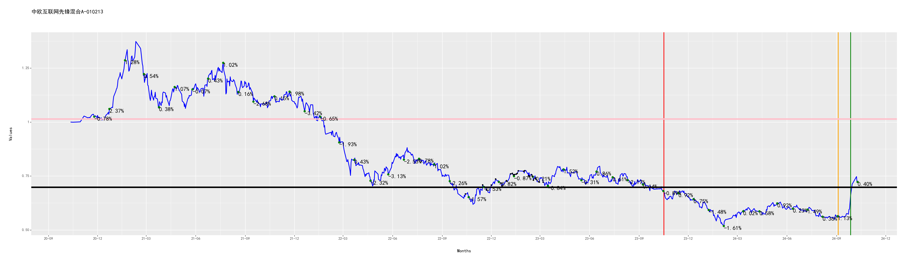
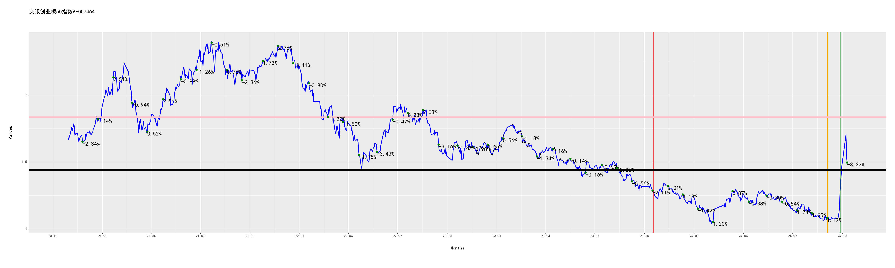

[](https://fund.readthedocs.io/zh_CN/latest/)
[](https://github.com/zhaisilong/fund)

前言
====

-   基于 Python 的量化投资基金的仓库.
-   本仓库所有的信息均不构成投资建议.
-   如果你对次项目感兴趣,欢迎右上角点赞.

安装
====

``` {.bash}
conda create -nfund python=3.8
# 深度学习 pytorch 套装
conda install pytorch torchvision torchaudio cudatoolkit=11.3 -c pytorch
pip install -i https://pypi.tuna.tsinghua.edu.cn/simple -r requirements.txt
```

使用
====

快速入手
--------

``` {.bash}
bash pipeline.sh
```

基本操作
--------

``` {.bash}
python crawl.py  # 爬取基金的信息
python analysis.py  # 基金分析
python track.py  # 基金跟踪
python predict.py  # 基金预测
python strtegy.py  # 制定策略
```

跟踪情况
========

全局跟踪
--------

```{=rst}
投资总金额：382.00元
卖出收益(扣税后)：4.91
基金价值：387.67元
收益率(卖出收益+基金价值/投资总金额,部分扣税)：2.77%

```
中欧互联网先锋混合A-010213
--------------------------

```{=rst}
投资总金额：16.00元
股份数：23.96份
当前每股单价：0.69元/份
卖出收益(扣税后)：0.00
基金价值：16.53元
收益率(卖出收益+基金价值/投资总金额,部分扣税)：3.32%
池子:
        date      stock day_delta  fee/%   value  improve/%
0 2022-10-14  23.962802   31 days    0.5  0.6667   3.479826
按低值出售的池子:
        date      stock day_delta  fee/%   value  improve/%
0 2022-10-14  23.962802   31 days    0.5  0.6667   3.479826

```


广发医药健康混合A-010110
------------------------

```{=rst}
投资总金额：16.00元
股份数：30.34份
当前每股单价：0.60元/份
卖出收益(扣税后)：0.00
基金价值：18.25元
收益率(卖出收益+基金价值/投资总金额,部分扣税)：14.09%
池子:
        date      stock day_delta  fee/%   value  improve/%
0 2022-10-11  30.338017   34 days    0.5  0.5266  14.261299
按低值出售的池子:
        date      stock day_delta  fee/%   value  improve/%
0 2022-10-11  30.338017   34 days    0.5  0.5266  14.261299

```


招商中证白酒指数(LOF)A-161725
-----------------------------

```{=rst}
投资总金额：238.00元
股份数：241.67份
当前每股单价：1.01元/份
卖出收益(扣税后)：0.00
基金价值：243.63元
收益率(卖出收益+基金价值/投资总金额,部分扣税)：2.37%
池子:
        date       stock day_delta  fee/%   value  improve/%
0 2022-10-12   18.646757   33 days    0.5  1.0715  -5.916939
1 2022-10-13   13.236797   32 days    0.5  1.0566  -4.590195
2 2022-10-18   13.275748   27 days    0.5  1.0535  -4.309445
3 2022-10-19   23.508187   26 days    0.5  1.0199  -1.156976
4 2022-10-20   23.286713   25 days    0.5  1.0296  -2.088190
5 2022-10-24  105.047319   21 days    0.5  0.9510   6.004206
6 2022-10-25   14.748497   20 days    0.5  0.9483   6.306021
7 2022-10-27   15.447316   18 days    0.5  0.9054  11.343053
8 2022-11-09   14.475264    5 days    1.5  0.9662   4.336576
按低值出售的池子:
        date       stock day_delta  fee/%   value  improve/%
0 2022-10-12   18.646757   33 days    0.5  1.0715  -5.916939
1 2022-10-13   13.236797   32 days    0.5  1.0566  -4.590195
2 2022-10-18   13.275748   27 days    0.5  1.0535  -4.309445
3 2022-10-19   23.508187   26 days    0.5  1.0199  -1.156976
4 2022-10-20   23.286713   25 days    0.5  1.0296  -2.088190
5 2022-10-24  105.047319   21 days    0.5  0.9510   6.004206
6 2022-10-25   14.748497   20 days    0.5  0.9483   6.306021
7 2022-10-27   15.447316   18 days    0.5  0.9054  11.343053
8 2022-11-09   14.475264    5 days    1.5  0.9662   4.336576

```
A-161725.png)

汇添富上证综合指数-470007
-------------------------

```{=rst}
投资总金额：70.00元
股份数：72.26份
当前每股单价：0.98元/份
卖出收益(扣税后)：0.00
基金价值：71.11元
收益率(卖出收益+基金价值/投资总金额,部分扣税)：1.58%
池子:
        date      stock day_delta  fee/%  value  improve/%
0 2022-10-13  14.418557   32 days    0.5  0.970   1.443299
1 2022-10-20  14.433437   25 days    0.5  0.969   1.547988
2 2022-11-03  14.706625   11 days    0.5  0.951   3.470032
3 2022-11-07  14.315251    7 days    0.5  0.977   0.716479
4 2022-11-08  14.388889    6 days    1.5  0.972   1.234568
按低值出售的池子:
        date      stock day_delta  fee/%  value  improve/%
0 2022-10-13  14.418557   32 days    0.5  0.970   1.443299
1 2022-10-20  14.433437   25 days    0.5  0.969   1.547988
2 2022-11-03  14.706625   11 days    0.5  0.951   3.470032
3 2022-11-07  14.315251    7 days    0.5  0.977   0.716479
4 2022-11-08  14.388889    6 days    1.5  0.972   1.234568

```


工银金融地产混合A-000251
------------------------

```{=rst}
投资总金额：14.00元
股份数：4.31份
当前每股单价：2.30元/份
卖出收益(扣税后)：4.91
基金价值：9.90元
收益率(卖出收益+基金价值/投资总金额,部分扣税)：5.81%
池子:
        date     stock day_delta  fee/%  value  improve/%
0 2022-11-04  4.312783   10 days    0.5  2.163   6.148867
按低值出售的池子:
        date     stock day_delta  fee/%  value  improve/%
0 2022-11-04  4.312783   10 days    0.5  2.163   6.148867

```


交银创业板50指数A-007464
------------------------

```{=rst}
```

