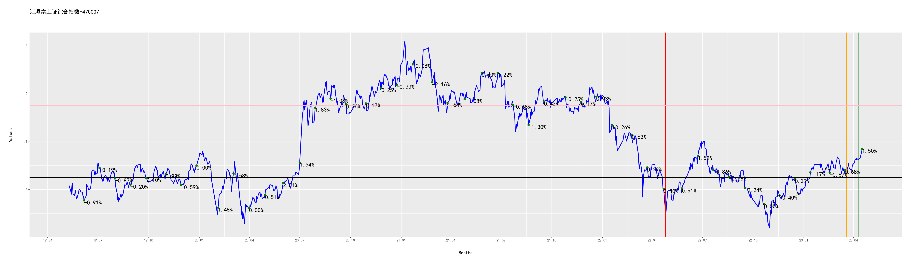

[](https://fund.readthedocs.io/zh_CN/latest/)
[](https://github.com/zhaisilong/fund)

# 前言

-   基于 Python 的量化投资基金的仓库.
-   本仓库所有的信息均不构成投资建议.
-   如果你对次项目感兴趣,欢迎右上角点赞.

# 安装

``` bash
conda create -nfund python=3.8
# 深度学习 pytorch 套装
conda install pytorch torchvision torchaudio cudatoolkit=11.3 -c pytorch
pip install -i https://pypi.tuna.tsinghua.edu.cn/simple -r requirements.txt
```

安装 [java runtime]{.title-ref}

``` bash
brew install java
brew install node
```

安装 [pandoc]{.title-ref}

``` bash
brew install pandoc  # for Darwin
sudo apt install pandoc  # for Ubuntu
```

# 使用

## 快速入手

``` bash
bash pipeline.sh
```

## 基本操作

``` bash
python crawl.py  # 爬取基金的信息
python analysis.py  # 基金分析
python track.py  # 基金跟踪
python predict.py  # 基金预测
python strtegy.py  # 制定策略
```

# 跟踪情况

## 全局跟踪

``` {. literal=""}
投资总金额：1442.00元
卖出收益(扣税后)：75.70
基金价值：1517.41元
收益率(卖出收益+基金价值/投资总金额,部分扣税)：10.48%
```

## 中欧互联网先锋混合A-010213

``` {. literal=""}
投资总金额：240.00元
股份数：331.17份
当前每股单价：0.76元/份
卖出收益(扣税后)：0.00
基金价值：251.09元
收益率(卖出收益+基金价值/投资总金额,部分扣税)：4.62%
池子:
         date      stock day_delta  fee/%   value  improve/%
0  2022-10-14  23.962802   96 days    0.5  0.6667  13.724314
1  2022-11-15  22.542684   64 days    0.5  0.7087   6.984620
2  2022-11-18  22.855508   61 days    0.5  0.6990   8.469242
3  2022-11-22  23.319223   57 days    0.5  0.6851  10.669975
4  2022-12-01  22.568159   48 days    0.5  0.7079   7.105523
5  2022-12-09  21.706522   40 days    0.5  0.7360   3.016304
6  2022-12-19  22.266202   30 days    0.5  0.7175   5.672474
7  2022-12-21  22.677076   28 days    0.5  0.7045   7.622427
8  2022-12-29  21.936015   20 days    0.5  0.7283   4.105451
9  2022-12-30  22.026748   19 days    0.5  0.7253   4.536054
10 2023-01-06  21.029354   12 days    0.5  0.7597  -0.197446
11 2023-01-09  20.963128    9 days    0.5  0.7621  -0.511744
12 2023-01-11  21.140664    7 days    0.5  0.7557   0.330819
13 2023-01-13  21.115517    5 days    1.5  0.7566   0.211472
14 2023-01-16  21.062624    2 days    1.5  0.7585  -0.039552
按低值出售的池子:
         date      stock day_delta  fee/%   value  improve/%
0  2022-10-14  23.962802   96 days    0.5  0.6667  13.724314
1  2022-11-15  22.542684   64 days    0.5  0.7087   6.984620
2  2022-11-18  22.855508   61 days    0.5  0.6990   8.469242
3  2022-11-22  23.319223   57 days    0.5  0.6851  10.669975
4  2022-12-01  22.568159   48 days    0.5  0.7079   7.105523
5  2022-12-09  21.706522   40 days    0.5  0.7360   3.016304
6  2022-12-19  22.266202   30 days    0.5  0.7175   5.672474
7  2022-12-21  22.677076   28 days    0.5  0.7045   7.622427
8  2022-12-29  21.936015   20 days    0.5  0.7283   4.105451
9  2022-12-30  22.026748   19 days    0.5  0.7253   4.536054
10 2023-01-06  21.029354   12 days    0.5  0.7597  -0.197446
11 2023-01-09  20.963128    9 days    0.5  0.7621  -0.511744
12 2023-01-11  21.140664    7 days    0.5  0.7557   0.330819
13 2023-01-13  21.115517    5 days    1.5  0.7566   0.211472
14 2023-01-16  21.062624    2 days    1.5  0.7585  -0.039552
```


## 广发医药健康混合A-010110

``` {. literal=""}
投资总金额：248.00元
股份数：415.76份
当前每股单价：0.69元/份
卖出收益(扣税后)：0.00
基金价值：286.79元
收益率(卖出收益+基金价值/投资总金额,部分扣税)：15.64%
池子:
         date      stock day_delta  fee/%   value  improve/%
0  2022-10-11  30.338017   99 days    0.5  0.5266  30.991265
1  2022-10-18  26.773923   92 days    0.5  0.5967  15.602480
2  2022-11-21  26.608927   58 days    0.5  0.6004  14.890073
3  2022-11-22  27.318741   57 days    0.5  0.5848  17.954856
4  2022-11-23  27.842454   56 days    0.5  0.5738  20.216103
5  2022-11-28  28.416933   51 days    0.5  0.5622  22.696549
6  2022-12-01  27.431319   48 days    0.5  0.5824  18.440934
7  2022-12-02  27.668860   47 days    0.5  0.5774  19.466574
8  2022-12-09  94.277525   40 days    0.5  0.5931  16.304165
9  2022-12-19  27.866736   30 days    0.5  0.5733  20.320949
10 2023-01-06  24.943013   12 days    0.5  0.6405   7.697112
11 2023-01-13  23.452730    5 days    1.5  0.6812   1.262478
12 2023-01-16  22.822857    2 days    1.5  0.7000  -1.457143
按低值出售的池子:
         date      stock day_delta  fee/%   value  improve/%
0  2022-10-11  30.338017   99 days    0.5  0.5266  30.991265
1  2022-10-18  26.773923   92 days    0.5  0.5967  15.602480
2  2022-11-21  26.608927   58 days    0.5  0.6004  14.890073
3  2022-11-22  27.318741   57 days    0.5  0.5848  17.954856
4  2022-11-23  27.842454   56 days    0.5  0.5738  20.216103
5  2022-11-28  28.416933   51 days    0.5  0.5622  22.696549
6  2022-12-01  27.431319   48 days    0.5  0.5824  18.440934
7  2022-12-02  27.668860   47 days    0.5  0.5774  19.466574
8  2022-12-09  94.277525   40 days    0.5  0.5931  16.304165
9  2022-12-19  27.866736   30 days    0.5  0.5733  20.320949
10 2023-01-06  24.943013   12 days    0.5  0.6405   7.697112
11 2023-01-13  23.452730    5 days    1.5  0.6812   1.262478
12 2023-01-16  22.822857    2 days    1.5  0.7000  -1.457143
```


## 招商中证白酒指数(LOF)A-161725

``` {. literal=""}
投资总金额：322.00元
股份数：252.81份
当前每股单价：1.26元/份
卖出收益(扣税后)：70.79
基金价值：318.90元
收益率(卖出收益+基金价值/投资总金额,部分扣税)：21.02%
池子:
         date       stock day_delta  fee/%   value  improve/%
0  2022-10-19    1.667489   91 days    0.5  1.0199  23.678792
1  2022-10-20   23.286713   90 days    0.5  1.0296  22.513598
2  2022-10-24  105.047319   86 days    0.5  0.9510  32.639327
3  2022-10-25   14.748497   85 days    0.5  0.9483  33.016978
4  2022-10-27   15.447316   83 days    0.5  0.9054  39.319638
5  2022-11-09   14.475264   70 days    0.5  0.9662  30.552681
6  2022-11-14   13.946949   65 days    0.5  1.0028  25.787794
7  2022-11-21   14.070423   58 days    0.5  0.9940  26.901408
8  2022-11-24   14.264151   55 days    0.5  0.9805  28.648649
9  2022-12-26   12.238362   23 days    0.5  1.1428  10.378019
10 2022-12-29   12.222319   20 days    0.5  1.1443  10.233330
11 2023-01-09   11.398533    9 days    0.5  1.2270   2.803586
按低值出售的池子:
         date      stock day_delta  fee/%   value  improve/%
0  2022-10-12  18.646757   98 days    0.5  1.0715  17.722818
1  2022-10-13  13.236797   97 days    0.5  1.0566  19.382926
2  2022-10-18  13.275748   92 days    0.5  1.0535  19.734219
3  2022-10-19  23.508187   91 days    0.5  1.0199  23.678792
4  2022-10-20  23.286713   90 days    0.5  1.0296  22.513598
5  2022-10-24  68.243132   86 days    0.5  0.9510  32.639327
6  2022-11-09  14.475264   70 days    0.5  0.9662  30.552681
7  2022-11-14  13.946949   65 days    0.5  1.0028  25.787794
8  2022-11-21  14.070423   58 days    0.5  0.9940  26.901408
9  2022-11-24  14.264151   55 days    0.5  0.9805  28.648649
10 2022-12-26  12.238362   23 days    0.5  1.1428  10.378019
11 2022-12-29  12.222319   20 days    0.5  1.1443  10.233330
12 2023-01-09  11.398533    9 days    0.5  1.2270   2.803586
```

A-161725.png)

## 汇添富上证综合指数-470007

``` {. literal=""}
投资总金额：126.00元
股份数：128.56份
当前每股单价：1.04元/份
卖出收益(扣税后)：0.00
基金价值：134.22元
收益率(卖出收益+基金价值/投资总金额,部分扣税)：6.52%
池子:
        date      stock day_delta  fee/%  value  improve/%
0 2022-10-13  14.418557   97 days    0.5  0.970   7.628866
1 2022-10-20  14.433437   90 days    0.5  0.969   7.739938
2 2022-11-03  14.706625   76 days    0.5  0.951   9.779180
3 2022-11-07  14.315251   72 days    0.5  0.977   6.857728
4 2022-11-08  14.388889   71 days    0.5  0.972   7.407407
5 2022-11-18  14.170213   61 days    0.5  0.987   5.775076
6 2022-12-19  13.916418   30 days    0.5  1.005   3.880597
7 2022-12-21  14.084592   28 days    0.5  0.993   5.135952
8 2022-12-23  14.127273   26 days    0.5  0.990   5.454545
按低值出售的池子:
        date      stock day_delta  fee/%  value  improve/%
0 2022-10-13  14.418557   97 days    0.5  0.970   7.628866
1 2022-10-20  14.433437   90 days    0.5  0.969   7.739938
2 2022-11-03  14.706625   76 days    0.5  0.951   9.779180
3 2022-11-07  14.315251   72 days    0.5  0.977   6.857728
4 2022-11-08  14.388889   71 days    0.5  0.972   7.407407
5 2022-11-18  14.170213   61 days    0.5  0.987   5.775076
6 2022-12-19  13.916418   30 days    0.5  1.005   3.880597
7 2022-12-21  14.084592   28 days    0.5  0.993   5.135952
8 2022-12-23  14.127273   26 days    0.5  0.990   5.454545
```



## 工银金融地产混合A-000251

``` {. literal=""}
投资总金额：14.00元
股份数：4.31份
当前每股单价：2.55元/份
卖出收益(扣税后)：4.91
基金价值：11.00元
收益率(卖出收益+基金价值/投资总金额,部分扣税)：13.64%
池子:
        date     stock day_delta  fee/%  value  improve/%
0 2022-11-04  4.312783   75 days    0.5  2.163  17.891817
按低值出售的池子:
        date     stock day_delta  fee/%  value  improve/%
0 2022-11-04  4.312783   75 days    0.5  2.163  17.891817
```


## 交银创业板50指数A-007464

``` {. literal=""}
投资总金额：180.00元
股份数：112.23份
当前每股单价：1.73元/份
卖出收益(扣税后)：0.00
基金价值：194.53元
收益率(卖出收益+基金价值/投资总金额,部分扣税)：8.07%
池子:
         date     stock day_delta  fee/%   value  improve/%
0  2022-11-10  7.525437   69 days    0.5  1.5922   8.861952
1  2022-11-14  7.452419   65 days    0.5  1.6078   7.805697
2  2022-11-17  7.438540   62 days    0.5  1.6108   7.604917
3  2022-11-25  7.646946   54 days    0.5  1.5669  10.619695
4  2022-11-28  7.687668   51 days    0.5  1.5586  11.208777
5  2022-12-01  7.426092   48 days    0.5  1.6135   7.424853
6  2022-12-05  7.451956   44 days    0.5  1.6079   7.798992
7  2022-12-09  7.279023   40 days    0.5  1.6461   5.297370
8  2022-12-14  7.472870   35 days    0.5  1.6034   8.101534
9  2022-12-19  7.504697   30 days    0.5  1.5966   8.561944
10 2022-12-23  7.710921   26 days    0.5  1.5539  11.545144
11 2022-12-26  7.557714   23 days    0.5  1.5854   9.328876
12 2022-12-29  7.504227   20 days    0.5  1.5967   8.555145
13 2022-12-30  7.522129   19 days    0.5  1.5929   8.814113
14 2023-01-13  7.052384    5 days    1.5  1.6990   2.018835
按低值出售的池子:
         date     stock day_delta  fee/%   value  improve/%
0  2022-11-10  7.525437   69 days    0.5  1.5922   8.861952
1  2022-11-14  7.452419   65 days    0.5  1.6078   7.805697
2  2022-11-17  7.438540   62 days    0.5  1.6108   7.604917
3  2022-11-25  7.646946   54 days    0.5  1.5669  10.619695
4  2022-11-28  7.687668   51 days    0.5  1.5586  11.208777
5  2022-12-01  7.426092   48 days    0.5  1.6135   7.424853
6  2022-12-05  7.451956   44 days    0.5  1.6079   7.798992
7  2022-12-09  7.279023   40 days    0.5  1.6461   5.297370
8  2022-12-14  7.472870   35 days    0.5  1.6034   8.101534
9  2022-12-19  7.504697   30 days    0.5  1.5966   8.561944
10 2022-12-23  7.710921   26 days    0.5  1.5539  11.545144
11 2022-12-26  7.557714   23 days    0.5  1.5854   9.328876
12 2022-12-29  7.504227   20 days    0.5  1.5967   8.555145
13 2022-12-30  7.522129   19 days    0.5  1.5929   8.814113
14 2023-01-13  7.052384    5 days    1.5  1.6990   2.018835
```


