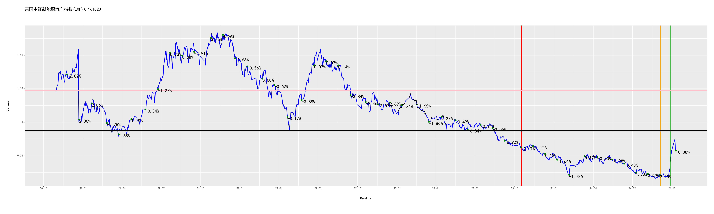

|docs| |stars|

前言
----

-  基于 Python 的量化投资基金的仓库.
-  本仓库所有的信息均不构成投资建议.
-  如果你对次项目感兴趣,欢迎右上角点赞.

安装
----

.. code:: bash

   mamba create -nfund python=3.8
   mamba activate fund
   mamba install pytorch torchvision torchaudio cudatoolkit=11.8 -c pytorch
   pip install -i https://pypi.tuna.tsinghua.edu.cn/simple -r requirements.txt

安装 `java runtime`

.. code:: bash

    brew install java
    brew install node

    # Ubuntu
    sudo apt install default-jdk nodejs npm
    java -version; node -v; npm -v

安装 `pandoc`

.. code:: bash

    brew install pandoc  # for Darwin
    sudo apt install pandoc  # for Ubuntu

使用
----

快速入手
~~~~~~~~

.. code:: bash

   bash pipeline.sh

基本操作
~~~~~~~~

.. code:: bash

   python crawl.py  # 爬取基金的信息
   python analysis.py  # 基金分析
   python track.py  # 基金跟踪，记录你的购买和卖出记录；在走势图中打印
   python predict.py  # 基金预测
   python strtegy.py  # 制定策略

   # Record your buy and sell information
   python record

Bug
~~~~~~~~

WARNING  matplotlib.font_manager: findfont: Font family 'SimHei' not found.

.. code:: bash

   python bin/fix_matplotlib.py
   
跟踪情况
--------

- 三根点
  - 🔴 红色点：卖出
  - ⚫️ 黑色点：买入
  - 🟢 绿色点：数据点，当日涨跌
- 三根垂直线（除去双休日）
  - 年（红），月（黄），日（绿）
- 两根水平线（3/7 分位线）
  - 黑色（低位线）
  - 粉色（高位线）

全局跟踪
~~~~~~~~~~~~~~~~~~~~~~~~~~

.. include:: data/trace/reports/finance.txt
   :literal:

中欧互联网先锋混合A-010213
~~~~~~~~~~~~~~~~~~~~~~~~~~

.. include:: data/trace/reports/中欧互联网先锋混合A-010213.txt
   :literal:

|010213|

广发医药健康混合A-010110
~~~~~~~~~~~~~~~~~~~~~~~~~~

.. include:: data/trace/reports/广发医药健康混合A-010110.txt
   :literal:

|010110|

招商中证白酒指数(LOF)A-161725
~~~~~~~~~~~~~~~~~~~~~~~~~~

.. include:: data/trace/reports/招商中证白酒指数(LOF)A-161725.txt
   :literal:

|161725|

汇添富上证综合指数-470007
~~~~~~~~~~~~~~~~~~~~~~~~~~

.. include:: data/trace/reports/汇添富上证综合指数-470007.txt
   :literal:

|470007|

工银金融地产混合A-000251
~~~~~~~~~~~~~~~~~~~~~~~~~~

.. include:: data/trace/reports/工银金融地产混合A-000251.txt
   :literal:

|000251|

交银创业板50指数A-007464
~~~~~~~~~~~~~~~~~~~~~~~~~~

.. include:: data/trace/reports/交银创业板50指数A-007464.txt
   :literal:

|007464|

诺安成长混合-320007
~~~~~~~~~~~~~~~~~~~~~~~~~~

.. include:: data/trace/reports/诺安成长混合-320007.txt
   :literal:

|320007|

富国中证新能源汽车指数(LOF)A-161028
~~~~~~~~~~~~~~~~~~~~~~~~~~

.. include:: data/trace/reports/富国中证新能源汽车指数(LOF)A-161028.txt
   :literal:

|161028|

.. |docs| image:: https://readthedocs.org/projects/fund/badge/?version=latest
   :target: https://fund.readthedocs.io/zh_CN/latest/
.. |stars| image:: https://shields.io/github/stars/zhaisilong/fund?style=social
   :target: https://github.com/zhaisilong/fund
.. |010213| image:: data/trace/imgs/中欧互联网先锋混合A-010213.png
.. |010110| image:: data/trace/imgs/广发医药健康混合A-010110.png
.. |161725| image:: data/trace/imgs/招商中证白酒指数(LOF)A-161725.png
.. |470007| image:: data/trace/imgs/汇添富上证综合指数-470007.png
.. |000251| image:: data/trace/imgs/工银金融地产混合A-000251.png
.. |007464| image:: data/trace/imgs/交银创业板50指数A-007464.png
.. |320007| image:: data/trace/imgs/诺安成长混合-320007.png

