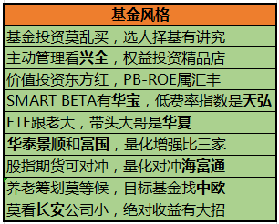
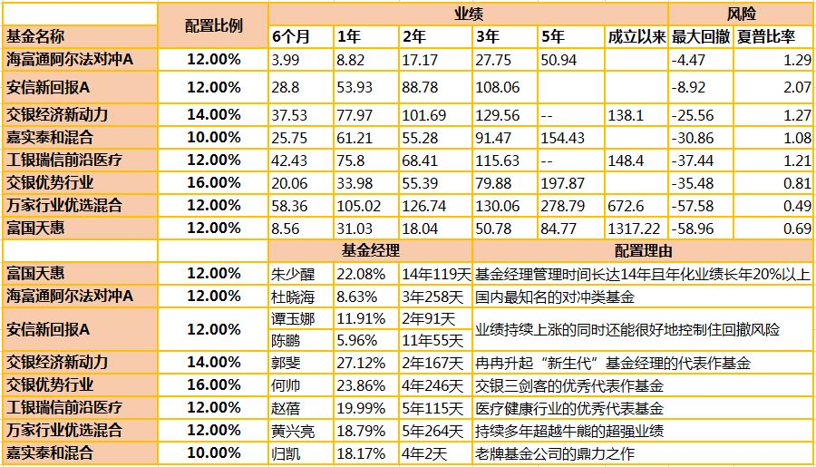

选择优质基金，让专业的基金经理帮我们选择优秀的股票。（择股）
我们普通人研究股票的难度还是很大的，需要研究行业、公司业务、财报等等。最好的办法还是选一个好基金，好基金会帮我们选出好股票。

第一步，选业绩持续优秀的基金
目前业内常用的筛选基金业绩的方法是：“4433法则”。
这个方法由台湾大学的两位教授提出，以长期、中期、短期业绩排名作为筛选依据，认为同时符合 4 个筛选标准的基金，就是市场上的优质基金。
第一个 4： 选择一年期业绩排名在同类基金中排前 1/4 的基金；
第二个 4： 选择两年、三年、五年、今年以来业绩排名在同类基金中排前 1/4 的基金；
第一个 3： 选择近 6 个月业绩排名在同类基金中排前 1/3 的基金；
第二个 3： 选择近 3 个月业绩排名在同类基金中排前 1/3 的基金。

“4433”法“兼顾长中短期业绩”，可以选出业绩持续优秀的基金。

第二步：选风险低的基金
基金的风险如何衡量，主要看下跌幅度。
A 基金赚 20% 收益，最大下跌 5%。
B 基金赚 20% 收益，最大下跌 80%。

虽然都是 20% 收益，买 A 基金，不会亏钱，一直赚钱，拿着很爽。
买 B 基金，最高亏损 60%，100 万最高亏 60 万，大多数人会彻底崩溃，割肉出局白白亏损。
我们很容易看出 A 基金比 B 基金风险低。
有学术研究显示，最大回撤在 30% 以内，散户通常可以接受；回撤 30%～50%，人们会觉得损失惨重；如果跌掉50%～60%甚至更多的时候，大部分人就彻底崩溃，割肉出局白白亏损。

所以我们一般选最大回撤（从最高点下跌到最低点的幅度）在 30% 以内的基金。

第三步：选从业 4 年以上的成熟基金经理
投资行业水很深，学校里的理论知识学得再好，量化模型做得再出色，没经历过牛熊历练，人性考验，还是很难成长为一名优秀的基金经理的。
一般 4 年是一个牛熊轮回，所以要选从业 4 年以上，经历过牛熊历练的基金经理。
此外要看基金经理过往业绩，优秀且稳定的过往业绩是一个基金经理能力最有效的证明，一般过往业绩在 15% 以上为佳。

第四步：选基金公司
每个基金公司都有自己擅长的领域。
有的基金公司擅长价值投资，比如：东方红，兴全基金，
而有的基金公司则更擅长成长股投资，比如：交银施罗德等，
最好选该基金公司擅长领域的明星基金。
各个基金公司的风格和侧重都是什么呢？

第五步：选基金规模、基金成立时间。
a 一般选5亿-50亿规模的主动基金

对于主动管理的偏股型基金：5亿-50亿的规模较好

规模过小对于业绩具有负面作用，像信息披露费、审计费、律师费等都是要固定支付的，规模过小的话分摊到单位份额上的成本就越高；

规模过大的话基金经理操作难度会加大，比如一个10亿的基金可能配置20只股票就够了，100亿的规模的话可能就需要配置100只甚至更多的股票，而A股市场优质的股票还是比较稀缺的，并且基金经理能跟踪的股票的数量也是有限的。

一般来说，5亿-50亿对主动管理型基金来说是比较合适的规模。

b 选基金成立时间：至少成立3年以上

如果基金成立时间太短，说明运作还没有稳定，业绩没办法评估，很难区分这个基金的业绩是来自于运气还是实力。

第六步，深入调研

首先，我们一定要去观察这个基金的历史持仓投资记录。

比如，对于价值型基金，你就要观察它的历史持仓记录里是不是总持有较多且表现优质的价值股。

它的仓位偏好如何？仓位调整频率如何？

是否有稳定行业偏好？

是否有稳定的估值偏好，整体持股的估值水平是否比行业平均要高？

再就是要看这个基金经理的历史言论，

搜集基金经理发表的文章、接受采访以及公开发表的言论、基金公司的宣传材料等，查看他的投资逻辑、投资体系，看其和实际持仓、实际操作！

搞清楚它的业绩表现怎么样？——业绩表现

为什么业绩会是这样？——持仓记录（反映选股风格、行业偏好、操作风格等）

什么样的投资逻辑支撑了这个投资业绩？——基金经理的投资逻辑

最后，查看资深投资者、同行的评价。基金是个比较小的圈子，一般优秀的基金内行人普遍公认，明星基金更是如雷贯耳。

按照上面六步筛选基金，不敢保证一定能选出前5%的明星基金，但选出前20%的优秀基金还是可以的！

综合以上六步我们选出了一个比较优秀的基金组合

