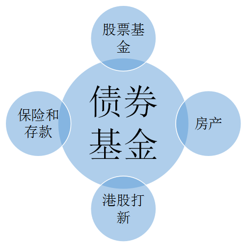

未来资产配置比例大概如下：

- 40% 房产
- 35% 股票
- 15% 债券
- 5% 现金和保险
- 5% 港股打新和海外资产

## 永动机策略

策略的中心是稳定回报的债券类基金，平均每年 6%-8% 左右的收益。
每月用不到的钱，通过周定投存到债券基金。
这里可以积蓄大量的资金，等股票便宜的时候买入股票，越跌越买。
股票基金预计赚取 10%-15% 的收益。

债券基金的买入方法：
每周定投，不停止。
周定投能降低波动低，还可以让资金非常灵活，如果需要，每周都有资金可以取出。
股票基金具体买入方法：
如果股市比过去 70% 的时候都便宜，每周开始定投股票基金。
如果股市比过去 80% 的时候都便宜，每周 2 倍定投股票基金。
如果股市比过去 90% 的时候都便宜，每周 3 倍定投股票基金。

当前全a等权静态市盈率比历史上80.0%的时候都便宜，所以我们开启2倍定投永动机-高收益，每周定投2万元。目前市场波动比较大，我2倍定投的方法是一周定投2次。
稳定收益组合依然周定投保持不变，直到银行存款大部分投入债券基金为止。
股市就是涨涨跌跌，和猪肉价格一样。现在相当于猪肉从15块跌到了8块钱，属于比较便宜的时候。如果没有极端情况，我们现在入手布局，未来几年，如果猪肉再涨到15块，我们就有50%-80%的盈利。

10年，1000万，就是这样一轮一轮布局-收获赚出来的。

## Reference

- 